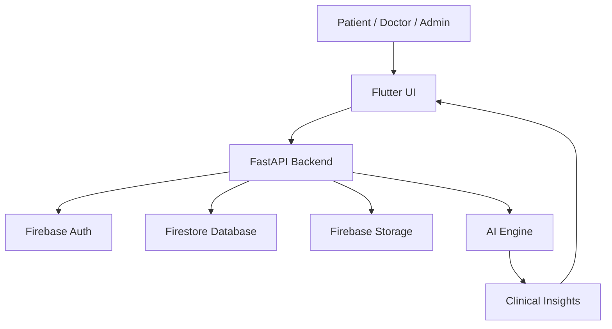

# System Architecture

## Architectural Style

Neuronix follows a modular, service-oriented architecture built around:

- Flutter frontend for patient, doctor, and admin experiences
- FastAPI backend for business logic and API orchestration
- Firebase for authentication, storage, and notification services
- AI services for OCR, NLP, prediction, and decision support

## High-Level Components

- Client Layer: Flutter mobile/web application
- API Layer: FastAPI routers and controllers
- Service Layer: authentication, appointment, report, notification, and AI services
- Data Layer: Firestore collections + object storage
- AI Layer: symptom interpretation, report parsing, risk scoring

## Flow

## Design Principles

- Clean architecture
- MVVM for UI state management
- SOLID principles
- Secure by default
- Explainable AI outputs
